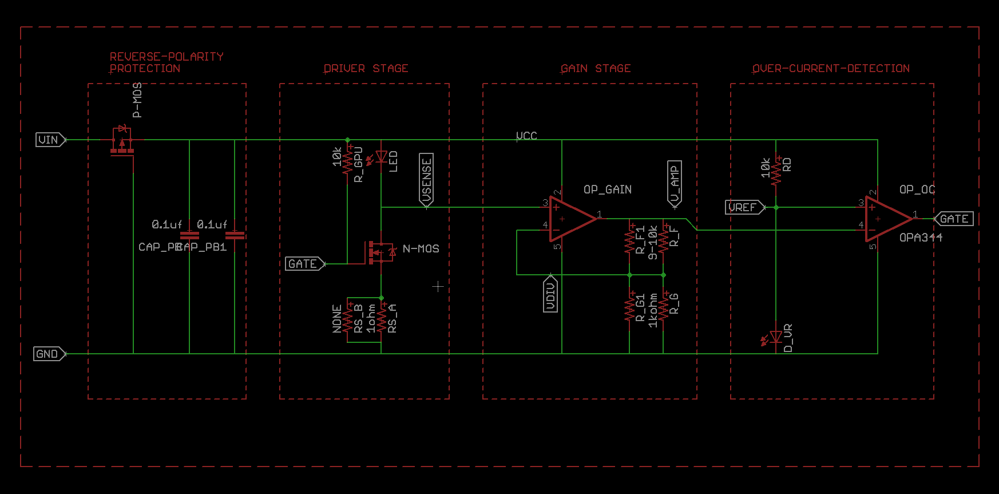

Large Learners LED 
================================
An exceptionally complex LED circuit to really capture the feel of screwing up. 

This LED breakout adds in circuitry to protect the LED, without altering the two-pronged nature of LEDs, but while preventing damage from overcurrent or reverse polarity use. When provided with too high of a current, this component turns off to simulate LED burnout. Unplugging the circuit and adding the correct current limiting resistor will get the LED to work again.

This component comes in two varieties: One is a small, LED-shaped board, intended for general usage. The second version is designed for 
use with a 3D printed cap, which provides light diffusion and a real, 10X scale LED.

Theory of Operation
-------------------
This schematic can be simplified into 4 small subsections. 

#### Reverse Polarity 
This section prevents damage if the LED plugs are reversed, and adds supply capacitors to help ensure smooth circuit operation. 

#### Driver Stage
This section contains the LED, in series with a N-MOSFET, and a small sense resistor. 
When the LED powers up, the following sequence of events happens in this stage: 
- VCC increases as power flows into the circuit from the power supply
- As VCC increases the pull up resistor ensures that the mosfet conducts, allowing current to flow
- As VCC increases, the current across the NMOS and Sense resistors increases proportionally. 
- Thanks to Ohm's Law, VSense is proportional to the LED current. 
The voltage of the NMos is roughly 0.8-1ohm when VCC is fully stabalized, giving a rough proportion of 2mV per mA of current.

#### Gain Stage
This stage takes the very small voltage Vsense, and boosts the voltage to a higher level to compare against. The exact amount of boosting will depend slightly on desired LED current, choice of mosfet, and and the forward voltage of the diode in the next stage.

#### Over-Current Protection Stage
This section takes the boosted voltage from the Gain Stage, and compares it to a volage reference, which in this case is a diode. A diode has a fairly consisttent forward voltage, assuming that the current going through it is reasonably consistent. By limiting the current with a 10K resistor, the forward voltage is about 0.25V for my diode, which generates Vref. (This will vary slightly by diode)

When the LED powers up, the following sequence happens in this stage: 
- The Driver stage generates a small sense voltage, Vsense. 
- The Gain Stage boosts Vsense, and outputs Vamp  
- During initial powerup, 

#### Calculating Voltages
Due to the comparison between Vamp and Vref, RF and RG must be calculated to generate the appropriate voltages. The circuit contains redundant resistor footprints to help calculate precise gains using standard components. 

The math for this can be quickly figured out with the following equations: 
- `Vsense = ILED*( RS + NMOS(on) )`
- `Vamp = Vsense * (1+RF/RG)`

Vsense is roughly constant, and is found using the I/V chart in the diode datasheet. (See also, known issues)

If multiple parallel resistors are used, then you can calculate the final resistance with `R=(1/( 1/R1 + 1/R2 ) )`

#### Subtleties of operation
Some of the strange behaviours of this circuit come from tricky aspects of the design. 
- The  OP Amps do not drive the line high nor low when the voltage is below ~2.3V. This happens during bootup, and is essential to ensuring that the pull up NMOS pull up resistor correctly activates the mosfet during powerup
- Without bypass capacitors in the Polarity Protection stage, the voltage rise on VCC is too sharp, and can cause the op-amps to activate before current flows through the LED. This can cause intermittent failures due to an unkown state. 
- During normal-current operation, the overcurrent op amp OP_OC pushes high. However, once OP_OC drives the MOSFET gate low, VSense immediately jumps to VCC, ensuring that OP_OC remains in over-current mode if the current is later reduced. To correct this state, the user must unplug the LED, accurately modelling the LED burnout when you forget your current limiting resistor.
- During over-current mode, it's worth noting that the Thevenin resistance of this circuit is drastically reduced. When in series with a resistor, this change causes the VIN and GND voltages to approach that of the supply voltage. This, in turn, helps ensure the over-current protection stays locked in.
- Due to the low input voltage into OP_GAIN, rail-to-rail op amps are neded for this design. 

Known Issues
------------

- Standard iodes do not provide a temperature compensated voltage reference
- LEDS placed in a plastic enclosure in sunlight get very hot
- As a result, the circuit tends to allow over-current when heated, somewhat diminishing the intention.
- Mounting holes on PCB don't line up with the 3D model, and are too small
- The small mounting holes can cause shorts to the top and bottom layers when assembled with metal screws.

